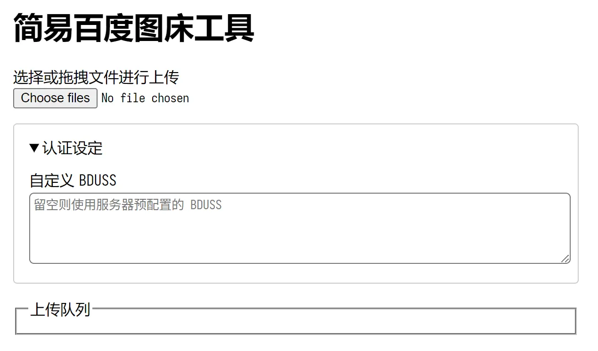

# 百度图床服务

使用百度的图片上传接口作图床使用。

目前还在开发阶段。



## 构建

只构建当前系统需要的二进制文件：

```shell
goreleaser build --single-target --snapshot --clearn
```

构建所有支持的系统和架构：

```shell
goreleaser release --skip=publish --clean
```
